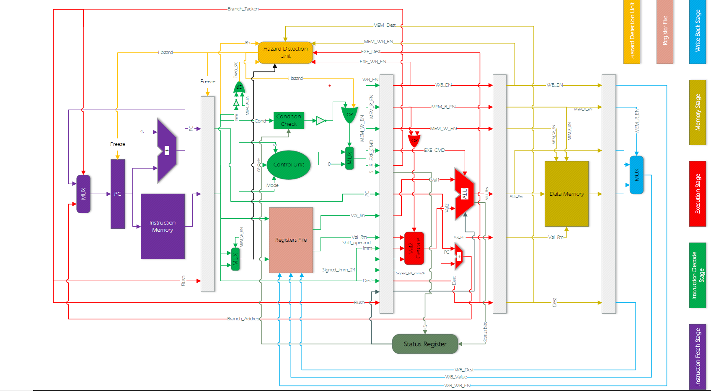

# In the Name of God

# computer-architecture-lab

# some tips:(some r obvious but for documantation)

### create new project:
    ctrl + n

### device name:
    EP2C35F672C6

### pin assignment:
    Assignments -> Import Assignments -> pin_assignment.csv

### programming:
    tools -> programmemr ->

#### thing u may need to do:
    Hardware Setup -> USB blaster
    Not detected: Auto detect
     <!--adding .sof file again write this part   -->

# signal tap:
    tools -> SignalTap II Logic Analyzer

## a.set license first time using signaltab:
    tools -> License setup ... -> internet connectivity -> 
    talkback options -> enable sending talkback data... -> ok

## b.signal configuration:

### 1.clock:
    all names, list, CLOCK_50, >, ok

### 2.type:
    conditional in lab
    lets always put SW[15] as our trigger with falling edge

### 3.sequential not steb based

# ARM datapath:
